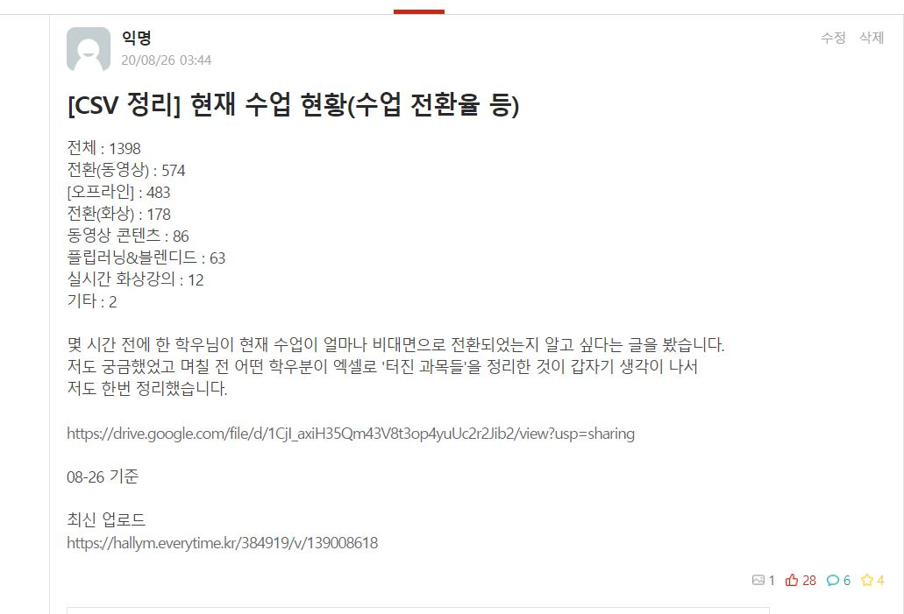

# 한림대하교 비대면 수치

### 한림대학교 비대면 수치를 직접 분석하여 그래프를 만들었다.

많은 학우 분들이 비대면 수치를 원했고 시각적으로 보여주기 위해 제작되었다.
로그인 세션을 제외한 모든 코드는 자동화로 이루어져 그래프를 보여준다.(Python 사용)

2020/08/26일 활동

<<<<<<< HEAD
=======
=======

>>>>>>> 2b3f119f8ed0820cab4434240c5c7c169cc3608d
한림대학교 학교 커뮤티니 좋아요 갯수 28개

[전체] 통계 수치

<<<<<<< HEAD

=======

>>>>>>> 2b3f119f8ed0820cab4434240c5c7c169cc3608d

